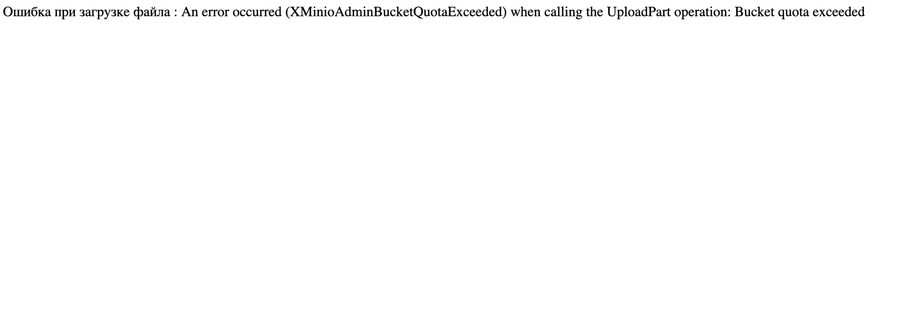

# Miniotask. 3 task in Cloud technology 2024

## Как запустить даннную работу

### Docker compose

В рамках данной демонстрации создается сеть из 3 докер-контейнеров: miniotask-minio, miniotask-nginx, miniotask-demoapp. На minio создается ограниченный bucket, в который будут выгружаться данные. Через nginx выполняется перенаправление запросов. Загрузка файлов выполняется через demoapp, который является приложением на Flask.

1. Убедитесь, что установлен Docker Compose.

3. Поднять докер-контейнеры. Находясь в корне проекта, выполнить следующую группу команд:

```bash
docker compose build
docker compose pull
docker compose up -d
```

4. Перейти в консоль MinIO. Создать в MinIO bucket с Quota `15 Mi`. Для примера используется название `images`.


5. Создать Access Key:


Указать Access Key Policy:

```json
{
 "Version": "2012-10-17",
 "Statement": [
  {
   "Effect": "Allow",
   "Action": [
    "admin:*"
   ]
  },
  {
   "Effect": "Allow",
   "Action": [
    "kms:*"
   ]
  },
  {
   "Effect": "Allow",
   "Action": [
    "s3:*"
   ],
   "Resource": [
    "arn:aws:s3:::images/*",
    "arn:aws:s3:::images"
   ]
  }
 ]
}
```

6. Остановить и удалить контейнеры с помощью вызова команды в корне проекта:

```bash
docker compose down
```

7. Указать в `docker-compose.yaml` имя созданного bucket, ACCESS_KEY и SECRET_KEY (переменные окружения контейнера `MINIO_BUCKET_NAME`, `MINIO_ACCESS_KEY` и `MINIO_SECRET_KEY` соответственно).

8. Поднять докер-контейнеры:

```bash
docker compose up -d
```

9. Перейти в демонстрационное приложение и радоваться жизни.

### main.py

Для демонстрации загрузки из папки можно воспользоваться консольной программой `main.py`.

1. Создать виртуальное окружение.

2. Установить пакеты питона. Выполнить команду, находять в корне проекта и в созданном окружении:

```bash
pip install -r requirements.txt
```

3. Указать в `main.py` имя созданного bucket, ACCESS_KEY и SECRET_KEY (переменные окружения контейнера `BUCKET_NAME`, `ACCESS_KEY` и `SECRET_KEY` соответственно).

4. Загрузить фотки котят в папку `images`, которая должна находится в корне проекта.

5. Запустить программу `python main.py`.

6. Радоваться котятам в контейнере S3 (не котлеты).


## Результаты работы

В данном разделе приведены скриншоты с процессом выполнения работы.

На обработку подгруженных данных требуется некоторое время, поэтому, если быстро превышается лимит, то загруженные файлы могут занимать больше выделенного места.


### Превышение выделенного Quota через MinIO

При загрузке файла, если считается, что в bucket есть свободное место, то при загрузке напрямую через MinIO это будет выглядеть так:


В случае, же если объем данных превышает установленную Quota это будет отображаться так:


### Превышение выделенного Quota через main.py

Как сказано было ранее, требуется некоторое время на обновление данных о занимаемой памяти. Поэтому проводилось 2 последовательных запуска `main.py`.

В первом случае все успешно загрузилось и были выведены соответствующие сообщения в консоль. Во втором случае произошла ошибка загрузки.


### Превышение выделенного Quota через Flask

Загрузка файлов происходит через форму Flask на поднятом докере.


В случае успешной загрузки будет выведено сообщение:


В случае, если загруженный файл превышает Quota, то будет выведено такое сообщение:



### Ограничение на диске для контейнера.

На просторах интернета в качестве реализации данной возможности предлагается использование файловых систем, например, [ZFS](https://docs.docker.com/engine/storage/drivers/zfs-driver/#configure-docker-with-the-zfs-storage-driver) или [плагины](https://forums.docker.com/t/how-do-you-limit-volume-storage/71229). Либо же нарезать место на диске и затем примонтировать папку на этом диске в рамках контейнера.

Как вариант, можно ограничить размер диска, запустив на виртуальной машине и в контейнере (LXC).
